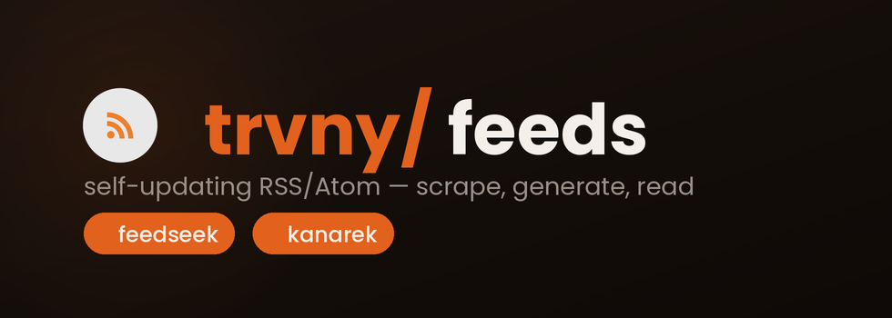

<div align="center">



**Feedseek + Kanarek 🐤: produkcja i konsumpcja feedów w jednym monorepo.**
Feedseek scrapuje strony bez RSS, generuje Atom i publikuje go na GitHub Pages, a Kanarek czyta feedy w natywnej aplikacji i widżecie na Androida.

[](https://trvny.github.io/feeds/)
[](https://github.com/trvny/feeds/actions/workflows/update-feeds.yml)
[](feedseek/feeds.yaml)
[](https://github.com/trvny/feeds/commits/main)
[](LICENSE)  
[**📡 Strona**](https://trvny.github.io/feeds/) · [**📖 Czytnik**](https://trvny.github.io/feeds/reader/) · [**🗂 Rejestr feedów**](feedseek/README.md#feeds-)  
**Polski** · [English](docs/README-EN.md)

</div>

---

## Feedseek + Kanarek 🐤

<div align="center">
<strong>🚪 Hol główny</strong>
</div>

<br>

<table>
<tr>
<td align="center" valign="top" width="50%">
<br>
<a href="kanarek/"></a>
<h2><a href="kanarek/">🐤 Kanarek</a></h2>
<strong>Czytaj feedy i oglądaj streamy</strong>
<p>Natywna aplikacja i widżety na Androida z czytnikiem wiadomości oraz odtwarzaczem radia/IPTV.</p>
<a href="kanarek/"><strong>WEJDŹ DO APLIKACJI →</strong></a>
<br><br>
<a href="kanarek/README.md">README</a> · <a href="kanarek/app/">Aplikacja</a> · <a href="kanarek/worker/">Worker</a>
<br><br>


<br><br>
</td>
<td align="center" valign="top" width="50%">
<br>
<a href="feedseek/"></a>
<h2><a href="feedseek/">📡 Feedseek</a></h2>
<strong>Produkuj i publikuj feedy</strong>
<p>Generatory RSS/Atom dla stron bez użytecznego feeda, odświeżane co 2 h i publikowane na GitHub Pages.</p>
<a href="feedseek/"><strong>WEJDŹ DO FEEDÓW →</strong></a>
<br><br>
<a href="https://trvny.github.io/feeds/">Strona</a> · <a href="https://trvny.github.io/feeds/reader/">Czytnik</a> · <a href="feedseek/README.md#feeds-">Rejestr</a>
<br><br>


<br><br>
</td>
</tr>
</table>

Oba robią to samo: `strona → Atom`, tylko z dwóch stron. `feedseek` działa **wsadowo w CI**, a `kanarek/worker` **on-demand na krawędzi** (`/discover` + `/scrape` → `RSS→JSON`).

## ⚙️ Jak to działa

```text
                  feeds.yaml (53 źródła)
                         │
   ┌─────────────────────┴─────────────────────┐
   │  feedseek — GitHub Actions, co 2 h         │
   │  scrape → parse → dedup → Atom XML          │
   └─────────────────────┬─────────────────────┘
                         │  publish
                         ▼
          trvny.github.io/feeds/  ──▶  /reader/  (czytnik OPML)
                         │
                         │  konsumpcja
                         ▼
          kanarek — widżet/apka Android  ◀──  worker (RSS→JSON)
```

- **Izolacja błędów** — jedno padnięte źródło nie blokuje reszty.
- **Hash-gated `updated`** — feed nie „mieli”, gdy wpis się nie zmienił.
- **Dedup** po znormalizowanym URL-u i tytule (cross-source).
- **Bot-protection** — `curl_cffi` + impersonacja Chrome ogarnia Cloudflare/Akamai/DataDome.

## 🗂 Struktura

```text
feeds/
├── feedseek/          # generatory RSS/Atom + statyczny czytnik
│   ├── feed_generators/
│   ├── feeds.yaml     # rejestr źródeł
│   ├── feeds/         # wygenerowane XML-e (CI)
│   └── site/          # build_site.py + reader.html
├── kanarek/           # apka Android + Cloudflare Worker
└── .github/workflows/ # CI obu projektów (przez working-directory)
```

Historia obu projektów (`feeds` + `kanarek`) została zachowana po konsolidacji do monorepo.

## 📄 [Licencja](LICENSE)


## 📰 Mininewsy

<!--README_FEED:START-->
- [Marka Cashify od lipca funkcjonuje jako kantor kryptowalut online w oparciu o przepisy MiCA](https://pap-mediaroom.pl/biznes-i-finanse/marka-cashify-od-lipca-funkcjonuje-jako-kantor-kryptowalut-online-w-oparciu-o)
- [Erste Letnie Brzmienia 2026 ruszają już dzisiaj. Kraków otwiera letnią trasę przez pięć miast](https://pap-mediaroom.pl/biznes-i-finanse/erste-letnie-brzmienia-2026-ruszaja-juz-dzisiaj-krakow-otwiera-letnia-trase-przez)
- [Humanoid pozyskuje 152 mln USD przy wycenie na kwotę 1,35 mld USD po przeprowadzeniu rundy finansowania, stając się pierwszym europejskim jednorożcem wyspecjalizowanym w robotach…](https://pap-mediaroom.pl/biznes-i-finanse/humanoid-pozyskuje-152-mln-usd-przy-wycenie-na-kwote-135-mld-usd-po)
- [Fresha przyspiesza ekspansję w Europie, otwierając nowe biuro w Warszawie i powołując Macieja Walczewskiego na stanowisko dyrektora generalnego na Europę Wschodnią](https://pap-mediaroom.pl/biznes-i-finanse/fresha-przyspiesza-ekspansje-w-europie-otwierajac-nowe-biuro-w-warszawie-i)
- [Mikropoświadczenia - nowa waluta umiejętności](https://pap-mediaroom.pl/polityka-i-spoleczenstwo/mikroposwiadczenia-nowa-waluta-umiejetnosci)
<!--README_FEED:END-->

## 💬 Cytat z szuflady

<!-- markdownlint-disable MD033 -->
<!--STARTS_HERE_QUOTE_README-->
<i>❝Coincidence is God's way of remaining anonymous. — Albert Einstein❞</i>
<!--ENDS_HERE_QUOTE_README-->
<!-- markdownlint-enable MD033 -->
