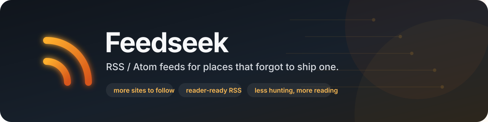

# Feedseek 📡

**Samoodświeżające się, ulepszane feedy RSS/Atom + JSON: zarówno tam, gdzie feedu brakuje, jak i tam, gdzie natywny da się zrobić lepiej.**

    
  
  
 

**Polski** · [English](README.md) · [简体中文](README_zh.md)  

[**📡 Feedy**](https://trvny.github.io/feedseek/) · [**📖 Czytnik**](https://trvny.github.io/feedseek/reader/) · [**🗂 Rejestr**](feeds.yaml) · [**🧭 Technicznie**](docs/)  

Feedseek wyszukuje albo buduje feedy, normalizuje wpisy, usuwa duplikaty i publikuje wynik przez GitHub Pages. Harmonogram odświeża źródła co dwie godziny, a awaria jednego serwisu nie powinna wywracać pozostałych.

Feedseek nie jest tylko generatorem dla stron, które nie mają feedu. Natywny RSS/Atom jest wartościowym źródłem wejściowym, ale nie nietykalnym produktem końcowym: jeśli materiał źródłowy na to pozwala, Feedseek normalizuje i wzbogaca go do stabilniejszej, pełniejszej, bogatszej semantycznie i bardziej interoperacyjnej postaci, publikując obok XML także JSON Feed 1.1.

Celem jest wykorzystywanie możliwości RSS, Atom i JSON Feed tak dobrze, jak pozwalają dane źródłowe: trwałe identyfikatory, kanoniczne linki, prawdziwe daty publikacji i aktualizacji, użyteczne metadane, pochodzenie, kategorie oraz media. Scrapery i adaptery API uzupełniają braki natywnych źródeł. Nieudane albo puste pobranie nie zastępuje ostatniego poprawnego feedu.

## Feedy

<!-- registry-count: feeds.yaml (109 źródeł) -->
Pełna tabela źródeł i bezpośrednich plików feedów znajduje się w [angielskim README](README.md#feeds-), a wygodniejszy interfejs do przeglądania i subskrypcji na [stronie Feedseek](https://trvny.github.io/feedseek/).

- **Rejestr:** [`feeds.yaml`](feeds.yaml)
- **Wygenerowane XML/JSON:** [`feeds/`](feeds/)
- **Indeks źródeł:** [`docs/sources.md`](docs/sources.md)
- **Notatki o poszczególnych feedach:** [`docs/feeds.md`](docs/feeds.md)

## Dokumentacja

- [Pipeline, enrichment, użycie lokalne i układ repozytorium](docs/architecture.md)
- [Źródła i kompromisy poszczególnych feedów](docs/feeds.md)
- [Działanie i utrzymanie cache](docs/cache.md)
- [Wygenerowany indeks źródeł](docs/sources.md)

Androidowy czytnik/player tych feedów to osobny projekt: **[travnie/kanarek](https://github.com/travnie/kanarek)**.

## [Licencja](LICENSE)

  [THIRD_PARTY_NOTICES](docs/THIRD_PARTY_NOTICES.md)

## 📰 Mininewsy

<!--README_FEED:START-->
- [Battery Ecosystems: A Comparative Analysis of Lithium-Ion Tech Policy](https://carnegieendowment.org/research/2026/09/battery-ecosystems-a-comparative-analysis-of-lithium-ion-tech-policy)
- [Matka Boża Wspomożenie Wiernych w Oświęcimiu ukoronowana - Diecezja Bielsko-Żywiecka](https://news.google.com/atom/articles/CBMijgFBVV95cUxNY2FHQW9wWmgyS01NM0ZpQ3lYZE15TXQ2dFFHZ0o4ZU1GUTh1Rm5kano3cmM5OGVERlpPX2t3ZnVBaktmdE9NU29QRTNBdjBQMUhXNTlSZThjeEN3cVRNWm1IZ2FEU1M2MXRQSE12NExLeXFxaDd3VldoSTJmMGxnY1N6RWZiNmhMd2ZxbHp3?oc=5)
- [Ponad 21 mln zł na inwestycję w Szczakowej. Powstaje nowy węzeł transportowy - jaw.pl](https://news.google.com/atom/articles/CBMibkFVX3lxTE1QTVNiQ3dzSHo4bTdhcFZ4cmpMV2F2TmIyRkQ0c0xmbno3ZGZtdFBudk9relZLZW9aUnp1dzZKMEFCUERESEsydDV2dkRBM2phTXlIaWd2aElpTHhOTnZRbERnMnZhR2NIQUF2T0pR?oc=5)
- [Biblioteka, sekretariat, szkolna kuchnia... Szkoła KSW w Libiążu ma wiele twarzy - Przelom.pl - portal ziemi chrzanowskiej](https://news.google.com/atom/articles/CBMivwFBVV95cUxQVTRhTFhRNGtyd24yanAtQXJOU1QyUmZ6RnBlRWxBT0c5WVlwVl9NMlNOZFdCQTlGMzdmbkNuQlp5c3NJRE10YTZPa05qeXRqZThzdVdQdDNOYWM2UDl5dXhhTnZLYkxieFZpdDRxRWUtQzA5Vk93ZWlZQ3MzTVZQSERVLXlzOUxtenpsMXVhRnA4aldJZEE3cDdCeGVBWWViV3FYUU9vZXJObzdJVXBhVlFma2x1NkM0ZEljS1E1TQ?oc=5)
- [Z bronią nie tylko na polowanie. Coraz więcej pozwoleń, także w powiecie chrzanowskim - Przelom.pl - portal ziemi chrzanowskiej](https://news.google.com/atom/articles/CBMiwwFBVV95cUxQSmpnbHJsaGIzUlVOVWxuaTN3SkxTdWpFZ3RScm9wcVpHMl8zRTk3Um1zaEhydVg4WDY5cHdpQTRrU2pkcVVQeVRtdVZnMldlUS10WV9OQUozc0RyR2Q0cmpkRmctclJKbGFPQUgyUlQ3R3prZmpYakpqcmEzZE5ZUkwwOFBxamRyUkR2emNlc3J4QjJVQkQtVjhMeWFKVFh5SDNjVmdJOVgtYmpPcGJWbWgzQU9qNjJxbmstMEhHSTEtLTg?oc=5)
- [Google rozdaje rabaty z okazji urodziny. Nawet 20% taniej za Pixela](https://antyweb.pl/google-rozdaje-rabaty-z-okazji-urodziny-nawet-20-taniej-za-pixela)
<!--README_FEED:END-->

## 💬 Cytat z szuflady

<!-- markdownlint-disable MD033 -->
<!--STARTS_HERE_QUOTE_README-->
<i>❝“The more you know, the more you realize you know nothing.”— Socrates❞</i>
<!--ENDS_HERE_QUOTE_README-->
<!-- markdownlint-enable MD033 -->

## Other stuff

 
